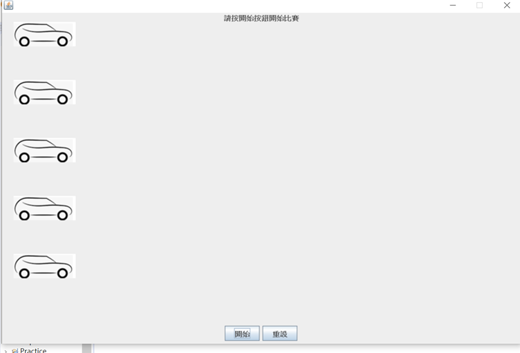
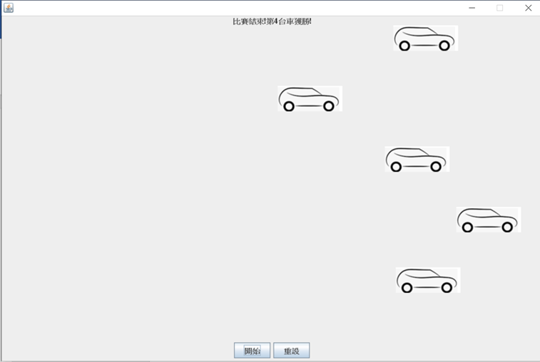

# 程式設計(二) 期末專題
## 陳柔安 409570183 

## 專題用途
此專題是一個賽車小遊戲，從上到下有編號1-5的輛車進行比賽，最先到視窗右邊界的車輛就獲勝。

## 使用方式
執行 com.ro.CarRace 程式。

1.程式開始畫面(圖一), 5台車位於起跑線,下方有兩個按鈕，上方顯示" 請按開始按鈕開始比賽! "。

2.當按下[開始]鈕時, 上方顯示" 比賽開始....... ", 畫面中的五輛車子會開始跑，最先到視窗右邊界的車輛就獲勝, 並顯示"比賽結束!第X台車獲勝! "。(圖二)

3.當按下[重設]鈕時, 則回到遊戲最初的狀態。(圖一)

(圖一)

(圖二)

